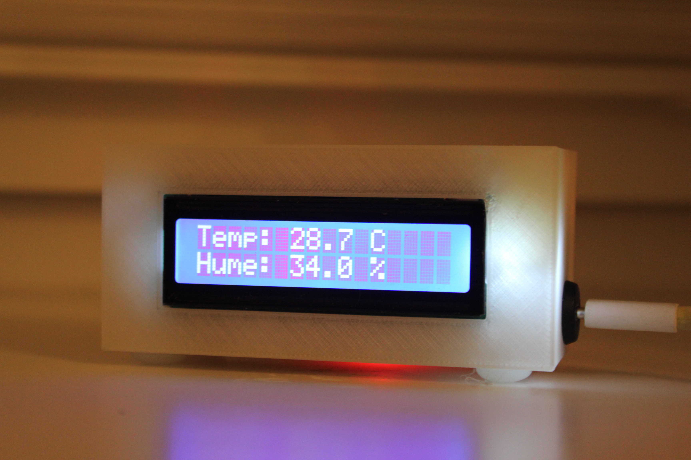
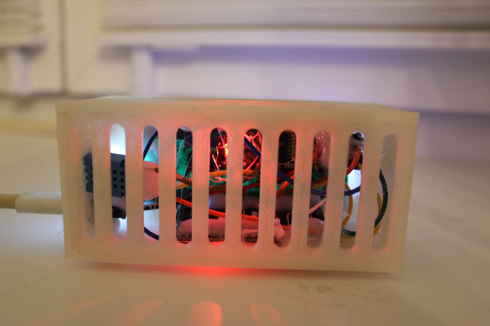

# ESP32 Temperature and Humidity Monitor

## Parts

-[ESP32 Dev Kit](https://de.aliexpress.com/item/1005008889403671.html?spm=a2g0o.productlist.main.1.11448Ncg8Ncgz1&algo_pvid=dc55a1c0-a7f9-4237-a7fb-2e6756b767f9&algo_exp_id=dc55a1c0-a7f9-4237-a7fb-2e6756b767f9-0&pdp_ext_f=%7B%22order%22%3A%22389%22%2C%22spu_best_type%22%3A%22price%22%2C%22eval%22%3A%221%22%2C%22fromPage%22%3A%22search%22%7D&pdp_npi=6%40dis%21EUR%218.96%218.96%21%21%2171.51%2171.51%21%40211b61d017704992817237380e04b4%2112000047093672773%21sea%21AT%213185561340%21X%211%210%21n_tag%3A-29919%3Bd%3A7ed0a960%3Bm03_new_user%3A-29895&curPageLogUid=tXjPesefn7LA&utparam-url=scene%3Asearch%7Cquery_from%3A%7Cx_object_id%3A1005008889403671%7C_p_origin_prod%3A)

-[DHT11 Sensor](https://de.aliexpress.com/item/1005008593539984.html?spm=a2g0o.productlist.main.7.6255qZx1qZx1Xh&algo_pvid=6c1c370a-4953-4688-9c9f-e21de472239b&algo_exp_id=6c1c370a-4953-4688-9c9f-e21de472239b-6&pdp_ext_f=%7B%22order%22%3A%22456%22%2C%22eval%22%3A%221%22%2C%22fromPage%22%3A%22search%22%7D&pdp_npi=6%40dis%21EUR%210.71%210.64%21%21%210.82%210.74%21%40211b612517704992244214531eb1f9%2112000048410393995%21sea%21AT%213185561340%21X%211%210%21n_tag%3A-29919%3Bd%3A7ed0a960%3Bm03_new_user%3A-29895&curPageLogUid=7IAPMfHh4HkV&utparam-url=scene%3Asearch%7Cquery_from%3A%7Cx_object_id%3A1005008593539984%7C_p_origin_prod%3A)

-[16x2 I2C LCD](https://de.aliexpress.com/item/1005006076050544.html?spm=a2g0o.productlist.main.31.77ac194bfESgOu&algo_pvid=16a135ba-c62f-42c9-8392-cf8dc62ad03b&algo_exp_id=16a135ba-c62f-42c9-8392-cf8dc62ad03b-30&pdp_ext_f=%7B%22order%22%3A%22172%22%2C%22eval%22%3A%221%22%2C%22fromPage%22%3A%22search%22%7D&pdp_npi=6%40dis%21EUR%211.69%211.10%21%21%2113.51%218.78%21%40211b61a417704993146986869eb792%2112000035616675892%21sea%21AT%213185561340%21X%211%210%21n_tag%3A-29919%3Bd%3A7ed0a960%3Bm03_new_user%3A-29895&curPageLogUid=lYRSQMRNvGjz&utparam-url=scene%3Asearch%7Cquery_from%3A%7Cx_object_id%3A1005006076050544%7C_p_origin_prod%3A)

-[Conector for USB-C](https://de.aliexpress.com/item/1005006637640070.html?spm=a2g0o.order_list.order_list_main.111.15ee5c5fhmO5df&gatewayAdapt=glo2deu)

-Wires

## 3D Prints

Case and other 3D printed parts are located in [3D-Parts](https://github.com/gamslet111/Temp-and-Hum-Station-with-I2C-Display/tree/master/Docs/3D-Prints).

## Code Versions

This project provides two code versions:

- **Without WiFi**: Basic version that reads sensor data, displays it on the LCD, and waits 60 seconds before the next measurement. No internet connection required. Use `Without Wifi.cpp`.
- **With WiFi**: Advanced version that includes WiFi connectivity and sends data to Firebase Realtime Database for remote monitoring. Requires WiFi and Firebase setup. Use `With Wifi.cpp` (rename to `main.cpp` in PlatformIO if needed).

## Features
- Reads temperature and humidity from DHT11 sensor.
- Displays data on a 16x2 I2C LCD (address 0x27).
- (WiFi version only) Sends data to Firebase Realtime Database for remote monitoring.
- Waits 60 seconds between measurements.
- Outputs data to serial monitor for debugging.

## Wiring
- **DHT11 Sensor**:
  - Data pin → GPIO 4 (ESP32)
  - VCC → 3.3V (ESP32)
  - GND → GND (ESP32)
- **16x2 I2C LCD**:
  - SDA → GPIO 21 (ESP32)
  - SCL → GPIO 22 (ESP32)
  - VCC → 3.3V (ESP32)
  - GND → GND (ESP32)
- **ESP32 Power Supply**:
  - Connect 5V from a lab power supply to VIN pin (ESP32) for external power.

## Software Requirements
- PlatformIO with Arduino framework.
- Libraries: DHT sensor library, LiquidCrystal_I2C.
- (WiFi version only) Firebase ESP32 Client library, Firebase account.

## Setup Instructions for Both Versions

### Version Without WiFi
1. Clone the repository.
2. Open `Without Wifi.cpp` in PlatformIO (ensure it's the basic version without WiFi code).
3. Upload the code to the ESP32.
4. Monitor serial output for data.
5. The ESP32 will measure data every 60 seconds, display it on the LCD, and continue running.

### Version With WiFi
1. Clone the repository.
2. Create a Firebase project at firebase.google.com and get your host URL and auth key.
3. Create a `config.h` file in `src/` with your WiFi SSID, password, Firebase host, and auth key (see example in config.h).
4. Open `With Wifi.cpp` in PlatformIO (rename it to `main.cpp` if needed for compilation).
5. Upload the code to the ESP32.
6. Monitor serial output for data and Firebase connection.
7. The ESP32 will connect to WiFi, send data to Firebase, display on LCD, and measure every 60 seconds.

## Usage
The ESP32 measures data every 60 seconds, displays it on the LCD, (if WiFi version) sends it to Firebase, and continues running.
